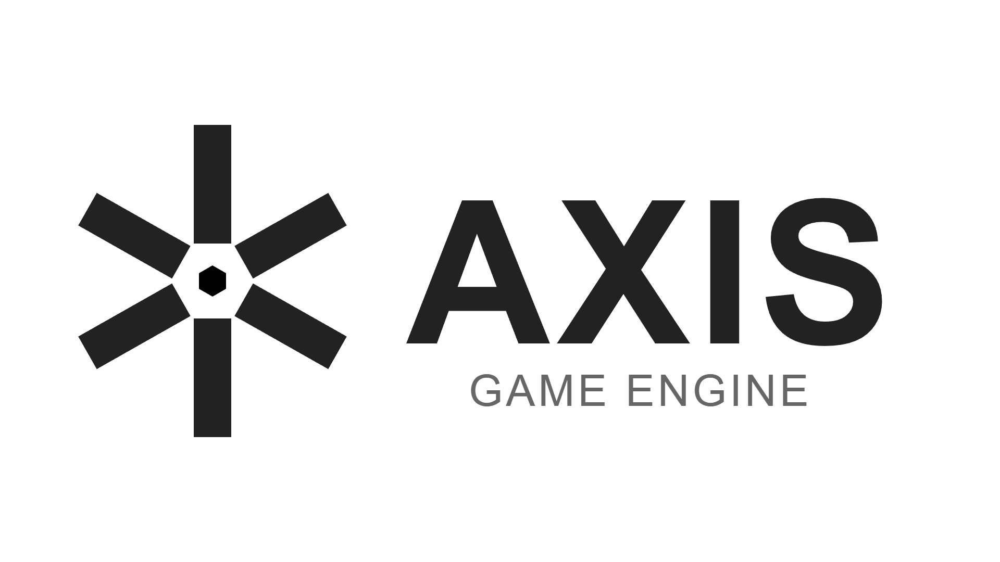

   
  
   

<h1 align="center">AXIS ENGINE</h1>

  <strong>High-Performance C++ ECS Configuration</strong>
   
  Developed by <a href="https://github.com/ItsK4tune">Duong "Caftun" Nguyen</a>

  <a href="#quick-start">🚀 Quick Start</a> •
  <a href="#documentation">📚 Documentation</a> •
  <a href="#features">✨ Features</a>

 
 
 

---

## Overview

**AXIS Engine** is a robust Entity-Component-System (ECS) based game engine built with modern C++ and OpenGL. It is designed for performance, flexibility, and ease of use, featuring a comprehensive Scene system, Physics integration, and an extensible Scripting API.

## Features

-   **ECS Architecture**: High-performance entity management using `EnTT`.
-   **Rendering**: OpenGL 3.3+ Forward Renderer with Dynamic Lighting & Shadows.
-   **Physics**: Integrated Bullet Physics engine for rigid body dynamics.
-   **Scripting**: Native C++ scripting support.
-   **Audio**: 3D Spatial Audio via `irrKlang`.
-   **Configuration**: JSON-based runtime configuration.

---

## Quick Start

1.  **Build**
    Run `build_engine.bat` to automatically configure and build the project.
    
2.  **Create a Scene**
    Add a new `.scene` file in the `scenes/` directory.
    
3.  **Run**
    Launch the executable from `bin/`. It will load `scenes/game.scene` by default.

---

## Documentation

### 📚 Guides
*   [Build Guide](docs/guides/build_guide.md)
*   [Project Structure](docs/guides/project_structure.md)
*   [State System](docs/guides/state_system.md)
*   [Configuration Guide](docs/guides/configuration.md)
*   [Device Management](docs/guides/device_management.md)
*   [Scripting Basics](docs/guides/scripting_basics.md)
*   [Scene Format](docs/guides/scene_format.md)
*   [Component Syntax Reference](docs/guides/components_reference.md)
*   [Asset Management](docs/guides/asset_management.md)
*   [Graphics Guide](docs/guides/graphics_guide.md)
*   [Post Processing](docs/guides/post_processing.md)

### ⚙️ API Reference
*   [Managers](docs/api/managers/)
*   [Components (C++)](docs/api/components/)
*   [Systems](docs/api/systems/)