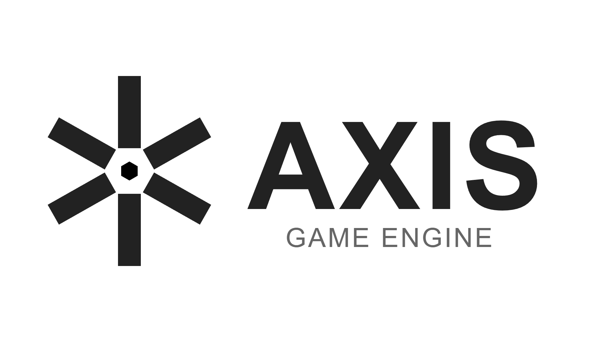

<p align="center">
  <br>
  
  <br>
</p>

<h1 align="center">AXIS ENGINE</h1>

<p align="center">
  <strong>High-Performance C++ ECS Game Engine</strong>
  <br>
  Developed by <a href="https://github.com/ItsK4tune">Duong "Caftun" Nguyen</a>
</p>

<p align="center">
  <a href="#-quick-start">🚀 Quick Start</a> •
  <a href="#-features">✨ Features</a> •
  <a href="#-documentation">📚 Documentation</a> •
  <a href="#-architecture">🏗️ Architecture</a>
</p>

<div align="center">

 
 


 


</div>

---

## 🎯 Overview

**AXIS Engine** is a modern, data-oriented game engine built with C++ 17 and OpenGL 3.3+. Designed for high performance and flexibility, it features a robust Entity-Component-System (ECS) architecture powered by EnTT, comprehensive physics simulation via Bullet Physics, and a powerful scripting system for rapid gameplay development.

Perfect for developers who want:
- ⚡ **Performance**: Data-oriented ECS architecture with cache-friendly memory access
- 🎨 **Flexibility**: Modular system design with easy extension points
- 🚀 **Productivity**: Hot-reload assets, comprehensive debug tools, and intuitive scene format
- 🎮 **Complete Toolkit**: Rendering, physics, audio, UI, particles, video playback - all included

---

## ✨ Features

### 🏗️ **Core Architecture**
- **ECS Framework**: High-performance entity management using [EnTT](https://github.com/skypjack/entt)
- **State Machine**: Robust game state management with lifecycle hooks
- **Scene System**: Human-readable text-based scene format with hot-reloading
- **Asset Pipeline**: Centralized resource management with automatic loading

### 🎨 **Graphics & Rendering**
- **Modern OpenGL**: Forward rendering with OpenGL 3.3+ Core Profile
- **Dynamic Lighting**: Directional, point, and spotlight support with shadow mapping
- **Material System**: Phong and PBR material models
- **Skybox Rendering**: Cubemap-based environment rendering
- **Particle System**: GPU-accelerated particle effects
- **Video Playback**: Real-time video decoding and texture mapping
- **Post-Processing**: Customizable post-processing pipeline

### ⚙️ **Physics & Simulation**
- **Bullet Physics**: Industry-standard physics with rigid bodies, constraints, and collision detection
- **Shape Support**: Box, sphere, capsule, and mesh colliders
- **Physics Materials**: Friction, restitution, and custom properties
- **Parent-Child Constraints**: Fixed joints for hierarchical physics objects
- **Debug Visualization**: Real-time physics debug rendering

### 🎵 **Audio**
- **3D Spatial Audio**: Position-based sound with distance attenuation via irrKlang
- **Sound Management**: Play, pause, loop, and volume control
- **Device Selection**: Runtime audio device switching
- **Multiple Sources**: Support for unlimited concurrent audio sources

### 🎮 **Input & Interaction**
- **Multi-Device Support**: Keyboard, mouse, and gamepad input
- **Input Mapping**: Customizable action binding system
- **Cursor Modes**: Normal, hidden, locked, and locked-hidden-center
- **UI Interaction**: Button clicks, hover effects, and event callbacks

### 📜 **Scripting**
- **Native C++ Scripts**: Full engine API access with zero overhead
- **Lifecycle Hooks**: OnCreate, OnUpdate, OnDestroy, and collision callbacks
- **Component Access**: Type-safe component retrieval and manipulation
- **Hot-Reload**: Script recompilation without restarting the engine
- **Input Binding**: Key/button binding system for gameplay controls

### 🖥️ **UI System**
- **Screen-Space UI**: Immediate-mode UI with transform, renderer, and text components
- **Interactive Elements**: Buttons with hover, click, and animation support
- **Text Rendering**: TrueType font support with FreeType
- **Z-Ordering**: Layered UI with depth sorting

### 🛠️ **Developer Tools**
- **Debug System**: Comprehensive F-key debug menu (F1-F12)
  - Performance overlay (FPS, frame time, entity count)
  - Physics debug rendering
  - Wireframe mode
  - Device information (CPU, GPU, monitors, audio)
  - Free camera mode
  - Time scale control
- **Hot-Reload**: Shaders, scripts, and assets reload at runtime
- **Resource Watcher**: Automatic asset reloading on file changes
- **Scene Graph Dump**: Inspect entity hierarchy and components

### ⚙️ **Configuration**
- **JSON Configuration**: Runtime settings for window, graphics, and audio
- **Scene-Based Config**: Per-scene rendering and physics override
- **Device Management**: Monitor, audio device, and input device selection

---

## 🚀 Quick Start

### Prerequisites
- **Compiler**: MSVC 2019+ (Visual Studio 2019 or newer)
- **CMake**: 3.15 or higher
- **Windows**: Windows 10/11 (64-bit)

### Build & Run

1. **Clone the repository**
   ```bash
   git clone https://github.com/ItsK4tune/GameEngine.git
   cd GameEngine
   ```

2. **Build the engine**
   ```bash
   build_engine.bat
   ```
   This script will:
   - Configure CMake
   - Build dependencies
   - Compile the engine and game project
   - Output executable to `bin/Release/`

3. **Run the engine**
   ```bash
   bin\Release\GameEngine.exe
   ```

The engine will load `scenes/game.scene` by default and start with a demo scene featuring physics objects, lighting, and a controllable camera.

---

## 📚 Documentation

### 📖 **Core Concepts**
- [Architecture Overview](docs/core/architecture.md) - High-level engine design
- [ECS System](docs/core/ecs_overview.md) - Entity-Component-System explained
- [Getting Started](docs/core/getting_started.md) - Your first game tutorial

### 🏗️ **State Management**
- [State API Reference](docs/state/state_api.md) - Complete State API with patterns

### 📜 **Scripting**
- [Scriptable API Reference](docs/scripting/scriptable_api.md) - Complete Scriptable API with patterns

### 🎨 **Guides**
- [Build Guide](docs/guides/build_guide.md) - Detailed compilation instructions
- [Project Structure](docs/guides/project_structure.md) - Codebase organization
- [Configuration Guide](docs/guides/configuration.md) - Engine and scene configuration
- [Scene Format Reference](docs/guides/scene_format.md) - Scene file syntax
- [Component Reference](docs/guides/components_reference.md) - All available components
- [Asset Management](docs/guides/asset_management.md) - Loading models, textures, and shaders
- [Graphics Guide](docs/guides/graphics_guide.md) - Rendering techniques and materials
- [Post Processing](docs/guides/post_processing.md) - Custom post-processing effects
- [Debug System](docs/guides/debug_system.md) - F-key shortcuts and debug tools
- [Device Management](docs/guides/device_management.md) - Monitor, audio, and input devices

### 🔧 **API Reference**
#### Components
- [Core Components](docs/components/core.md) - Transform, Info, Camera
- [Rendering Components](docs/components/rendering.md) - MeshRenderer, Material, Lights
- [Physics Components](docs/components/physics.md) - RigidBody configuration
- [UI Components](docs/components/ui.md) - UI Transform, Renderer, Text
- [Audio Components](docs/components/audio.md) - AudioSource
- [Scripting Components](docs/components/scripting.md) - ScriptComponent

#### Managers
- [Resource Manager](docs/managers/resource_manager.md) - Asset loading and caching
- [Scene Manager](docs/managers/scene_manager.md) - Scene loading and transitions
- [Sound Manager](docs/managers/sound_manager.md) - Audio playback control
- [Input Manager](docs/managers/input_manager.md) - Input device handling

#### Systems
- [Render System](docs/systems/render_system.md) - Rendering pipeline
- [Physics System](docs/systems/physics_system.md) - Physics simulation
- [Audio System](docs/systems/audio_system.md) - Audio processing
- [UI System](docs/systems/ui_system.md) - UI rendering and interaction
- [Video System](docs/systems/video_system.md) - Video decoding and playback
- [Event System](docs/systems/event_system.md) - Event handling

---

## 🏗️ Architecture

AXIS Engine follows a **data-oriented design** with a clear separation between data (Components) and behavior (Systems):

```
Application
    ├── State Machine (Game states)
    │   └── State (OnEnter, OnUpdate, OnRender, OnExit)
    │
    ├── ECS (Entity-Component-System)
    │   ├── Entities (IDs only, no data)
    │   ├── Components (Pure data structures)
    │   └── Systems (Logic processing components)
    │
    ├── Scene Management
    │   ├── Scene (ECS registry holder)
    │   ├── SceneLoader (Parse .scene files)
    │   └── SceneManager (Load/Unload/Change scenes)
    │
    ├── Resources
    │   ├── ResourceManager (Shaders, Models, Textures, Fonts)
    │   └── Hot-Reload & Caching
    │
    └── Managers
        ├── InputManager (Keyboard, Mouse, Gamepad)
        ├── SoundManager (irrKlang wrapper)
        ├── MonitorManager (Display configuration)
        └── AppHandler (Window & cursor control)
```

### Execution Flow
1. **Init**: Load configuration, create window, initialize systems
2. **Main Loop**:
   - Poll input events
   - **Fixed Update** (Physics at fixed timestep)
   - **Update** (Scripts, animation, video, particles)
   - **Render** (Shadows → Skybox → Models → Particles → UI)
   - Swap buffers
3. **Shutdown**: Cleanup resources and systems

See [Architecture Documentation](docs/core/architecture.md) for details.

---

## 🎯 Example: Creating a Simple Scene

Create a file `scenes/my_scene.scene`:

```
# Load essential resources
LOAD_SHADER myShader includes/engine/asset/shaders/phong_lit_shadow.vs includes/engine/asset/shaders/phong_lit_shadow.fs
LOAD_STATIC_MODEL cubeModel includes/engine/asset/objects/cube/cube.fbx
LOAD_FONT arial includes/engine/asset/fonts/arial.ttf 24

# Create a camera
NEW_ENTITY MainCamera
TRANSFORM 0 5 10  0 0 0  1 1 1
CAMERA 1 45.0 -90.0 0.0 0.1 1000.0
SCRIPT CameraController

# Create a lit cube
NEW_ENTITY Cube
TRANSFORM 0 2 0  0 0 0  1 1 1
RENDERER cubeModel myShader
MATERIAL PHONG 32 0.5 0.5 0.5
RIGIDBODY BOX 1.0 1 1 1 DYNAMIC

# Add lighting
NEW_ENTITY Sun
LIGHT_DIR -0.5 -1.0 -0.3 1.0 1.0 1.0 1.0

# Add UI text
NEW_ENTITY FPSCounter
UI_TRANSFORM 10 10 200 50 100
UI_TEXT "FPS: 60" arial 1 1 1 1.0
```

Load it from a game state:
```cpp
class MyGameState : public State {
    void OnEnter() override {
        LoadScene("scenes/my_scene.scene");
        EnablePhysics(true);
        EnableRender(true);
    }
    
    void OnUpdate(float dt) override {}
    void OnRender() override {}
    void OnExit() override {}
};
```

---

## 🤝 Contributing

Contributions are welcome! Please feel free to submit issues and pull requests.

### Development Setup
1. Follow the build instructions above
2. Make your changes
3. Test thoroughly
4. Submit a pull request with a clear description

---

## 📄 License

This project is licensed under the MIT License - see the [LICENSE](LICENSE) file for details.

---

## 🙏 Acknowledgments

**Dependencies:**
- [EnTT](https://github.com/skypjack/entt) - Entity-Component-System framework
- [Bullet Physics](https://github.com/bulletphysics/bullet3) - Physics simulation
- [GLFW](https://www.glfw.org/) - Window and input
- [Glad](https://glad.dav1d.de/) - OpenGL loader
- [GLM](https://github.com/g-truc/glm) - Mathematics library
- [Assimp](https://www.assimp.org/) - Model loading
- [stb_image](https://github.com/nothings/stb) - Image loading
- [FreeType](https://www.freetype.org/) - Font rendering
- [irrKlang](https://www.ambiera.com/irrklang/) - Audio engine
- [FFmpeg](https://ffmpeg.org/) - Video decoding

---

<p align="center">
  Made with ❤️ by <a href="https://github.com/ItsK4tune">Duong "Caftun" Nguyen</a>
  <br><br>
  <a href="#axis-engine">⬆ Back to Top</a>
</p>
