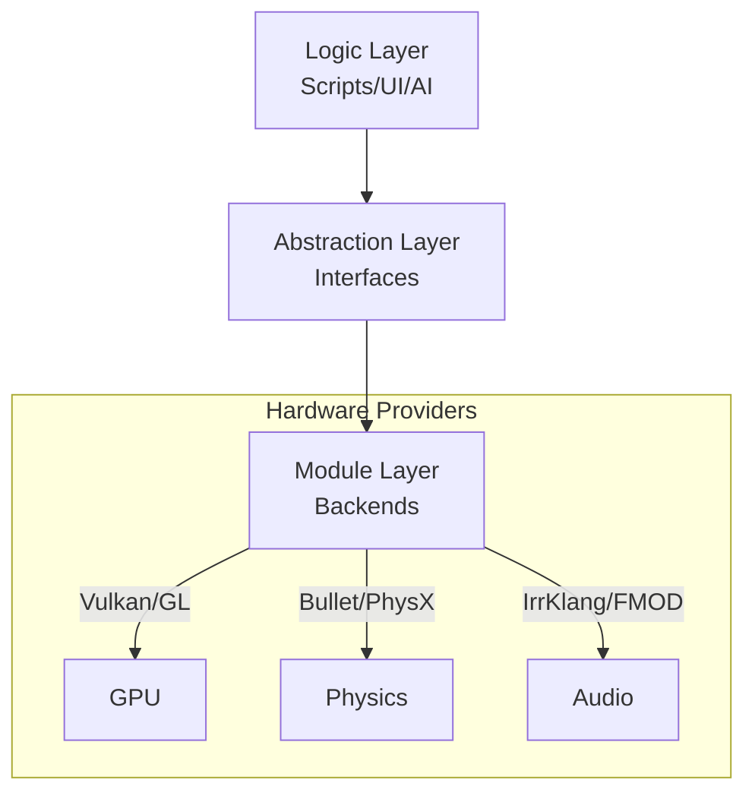

<p align="center">
  <br>
  
  <br>
</p>

<h1 align="center">AXIS ENGINE</h1>

<p align="center">
  <strong>Hybrid Modular C++ ECS Game Engine</strong>
  <br>
  Developed by <a href="https://github.com/ItsK4tune">Duong "Caftun" Nguyen</a>
</p>

<p align="center">
  <a href="#-quick-start">🚀 Quick Start</a> •
  <a href="#-features">✨ Features</a> •
  <a href="#-documentation">📚 Documentation</a> •
  <a href="#-architecture">🏗️ Architecture</a>
</p>

<div align="center">

 
 


 


</div>

---

## 🎯 Overview

**AXIS Engine** is a high-performance **hybrid modular** multimedia framework built with C++17. It leverages an interface-driven architecture to abstract hardware backends, providing a unified, data-oriented runtime via ECS (`entt`).

Designed for scalability and technical precision, AXIS allows developers to swap rendering (Vulkan/OpenGL), physics (Bullet/PhysX), and audio providers while maintaining a consistent gameplay logic layer.

---

---

## ✨ Features

### 🏗️ **Hybrid Architecture**
- **Modular Backends**: Swappable providers for Graphics (Vulkan/OpenGL), Physics (Bullet/PhysX), and Audio (IrrKlang/FMOD).
- **Data-Oriented Runtime**: High-performance entity management using [EnTT](https://github.com/skypjack/entt) with contiguous memory layout.
- **Multithreaded Job System**: Scalable task distribution across all CPU cores for asset decoding and system updates.

### 🎨 **Graphics & Rendering**
- **Hybrid Pipeline**: Support for both Forward and Deferred rendering paths.
- **PBR Pipeline**: Physically Based Rendering with HDR, Bloom, and ACES Tonemapping.
- **Advanced Decals**: Order-independent stabilized decals with tag-based filtering.
- **Performance**: Occulsion culling, Frustum culling, and Instanced batching.

### ⚙️ **Physics & Dynamics**
- **Modular Simulation**: Integrated interfaces for Bullet and PhysX providers.
- **Precision Modes**: Fast (30Hz), Balanced (60Hz), and Accurate (120Hz) simulation presets.
- **CCD**: Continuous Collision Detection for high-speed entities.
- **Visuals**: Real-time physics debug rendering and mesh-accurate colliders.

### 📐 **Navigation & AI**
- **Modular Pathfinding**: Swappable navigation providers supporting NavMesh and Grid-based A*.
- **Advanced Criteria**: Pathfinding based on `Shortest`, `Smoothest`, or `StayOnRoad` logic.
- **Steerings**: Group behaviors, obstacle avoidance, and path following.

### 🖥️ **UI & multimedia**
- **Responsive UI**: Resolution-independent anchoring and FlexBox-style layout system.
- **Video Decoding**: Asynchronous MP4 playback via FFmpeg with texture mapping.
- **Spatial Audio**: Position-based attenuation and 3D soundscapes.

### 🛠️ **Developer Workflow**
- **Hot-Reload**: Instant reloading for Shaders, Scripts, and Asset metadata.
- **Scene Format (.axs)**: Human-readable YAML hierarchy for entities and configuration.
- **Debug Suite**: Comprehensive F-key overlays for profiling, profiling, and device monitoring.

---

---

## 🚀 Quick Start

### Prerequisites
- **Compiler**: MSVC 2019+ (Visual Studio 2019 or newer)
- **CMake**: 3.15 or higher
- **Windows**: Windows 10/11 (64-bit)

### Build & Run

1. **Clone the repository**
   ```bash
   git clone https://github.com/ItsK4tune/GameEngine.git
   cd GameEngine
   ```

2. **Build the engine**
   ```bash
   build_engine.bat
   ```
   This script will:
   - Configure CMake
   - Build dependencies
   - Compile the engine and game project
   - Output executable to `bin/Release/`

3. **Run the engine**
   ```bash
   bin\Release\GameEngine.exe
   ```

The engine will load `scenes/game.scene` by default and start with a demo scene featuring physics objects, lighting, and a controllable camera.

---

## 🚀 Framework Workflow

AXIS is designed for a data-driven development cycle:

1.  **Build the Scene**: Define your world in an `.axs` (YAML) file. Specify entities, components, and initial properties.
2.  **Manage Resources**: Register models, shaders, and textures in the `Resources:` block to ensure zero runtime-hitching.
3.  **Code the Logic**:
    - **States**: Inherit from `State` to manage global loops (Menu, Play, Pause).
    - **Scripts**: Inherit from `Scriptable` for entity-specific behaviors (Input, AI, Triggers).
4.  **Configure**: Use the per-scene `Config:` block to set backend-agnostic parameters or specific module toggles (e.g., `PHYSICS_MODE: ACCURATE`).

---

## 💻 C++ Initialization Example

For a standalone application, initialize the `Application` pillar and push your first `State`:

```cpp
#include <engine/core/Application.h>
#include <game/states/GameState.h>

int main() {
    auto app = std::make_shared<Application>();

    AppConfig config;
    config.title = "Axis Engine - Game";
    config.width = 1280;
    config.height = 720;
    config.logLevel = LogLevel::Verbose;

    if (app->Initialize(config)) {
        app->PushState<GameState>(); // Your game entry point
        app->Run();
    }
    
    return 0;
}
```

---

## 🎯 Example: Creating a Simple Scene

Define a basic interactive world in `scenes/my_scene.axs`:

```yaml
axis_scene:
  Config:
    RENDER_PATH: DEFERRED
    SHADOW_RESOLUTION: 2048
    PHYSICS_MODE: BALANCED

  Entities:
    Player:
      Component: Transform
        Position: 0.0 2.0 0.0
      Component: Renderer
        Model: "models/player.obj"
      Component: RigidBody
        Type: CAPSULE
        Mass: 75.0
      Component: Script
        Class: PlayerController

    MainLight:
      Component: LightDir
        Intensity: 1.5
        CastShadow: 1
```

Load it from your game state:
```cpp
void MyState::OnEnter() {
    m_App->GetSceneManager().LoadScene("scenes/my_scene.axs");
}
```

---

## 📚 Technical Documentation

For deep technical details, please refer to the following specialized guides:

### 🛠️ **Core & Setup**
- **[Getting Started](docs/core/getting_started.md)**: Environment configuration and build tutorial.
- **[Architecture Deep-Dive](docs/core/architecture.md)**: Details on the Abstraction Layer and Pillar-Bridge-Provider pattern.
- **[Core Systems](docs/systems/core_systems.md)**: Scenes, Windowing, and Engine Lifecycle.

### 🧱 **Modular Module Guides**
- **[Graphics & Post-Processing](docs/guides/graphics.md)**: PBR, Decals, Culling, and Rendering Paths.
- **[Physics & Simulation](docs/guides/physics.md)**: Bullet/PhysX configuration and Character Controllers.
- **[Navigation & AI](docs/guides/navigation.md)**: Pathfinding, Steering, and NavMesh baking.
- **[User Interface (UI)](docs/guides/ui.md)**: Anchoring, FlexLayout, and Dynamic Text.

### ⚙️ **Workflow & Reference**
- **[Components Reference](docs/guides/components_reference.md)**: **(Essential)** List of all YAML keys and properties.
- **[Configuration Guide](docs/guides/configuration.md)**: Exhaustive list of all Global and Per-Scene settings.
- **[Scene Format (.axs)](docs/guides/scene_format.md)**: Detailed syntax for the serialization system.
- **[Scripting API](docs/scripting/scripting_api.md)**: C++ API patterns for gameplay.

---

## 🏗️ Architecture

AXIS Engine maintains a decoupled, high-performance runtime through its modular abstraction layer:


```mermaid
graph TD
    Logic[Logic Layer<br/>Scripts/UI/AI] --> Interface[Abstraction Layer<br/>Interfaces]
    Interface --> Backend[Module Layer<br/>Backends]
    
    subgraph "Hardware Providers"
        Backend -- Vulkan/GL --> GPU
        Backend -- Bullet/PhysX --> Physics
        Backend -- IrrKlang/FMOD --> Audio
    end
```

See the **[Modular Architecture](docs/core/architecture.md)** guide for more details.

---

## 🤝 Contributing

Contributions are welcome! Please feel free to submit issues and pull requests.

### Development Setup
1. Follow the build instructions above
2. Make your changes
3. Test thoroughly
4. Submit a pull request with a clear description

---

## 📄 License

This project is licensed under the MIT License - see the [LICENSE](LICENSE) file for details.

---

## 🙏 Acknowledgments

**Dependencies:**
- [EnTT](https://github.com/skypjack/entt) - Entity-Component-System framework
- [Bullet Physics](https://github.com/bulletphysics/bullet3) - Physics simulation
- [GLFW](https://www.glfw.org/) - Window and input
- [Glad](https://glad.dav1d.de/) - OpenGL loader
- [GLM](https://github.com/g-truc/glm) - Mathematics library
- [Assimp](https://www.assimp.org/) - Model loading
- [stb_image](https://github.com/nothings/stb) - Image loading
- [FreeType](https://www.freetype.org/) - Font rendering
- [irrKlang](https://www.ambiera.com/irrklang/) - Audio engine
- [FFmpeg](https://ffmpeg.org/) - Video decoding

---

<p align="center">
  Made with ❤️ by <a href="https://github.com/ItsK4tune">Duong "Caftun" Nguyen</a>
  <br><br>
  <a href="#axis-engine">⬆ Back to Top</a>
</p>
