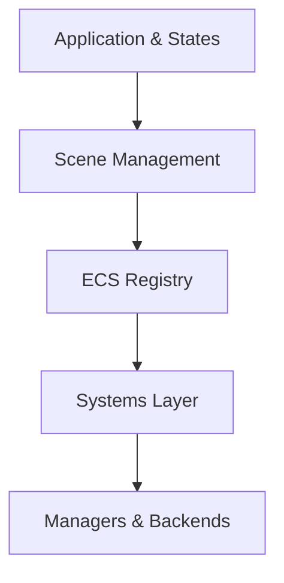

# Engine Architecture & Technology

AXIS Engine is a high-performance 3D engine built on **data-oriented design** principles. It separates **data** (Components) from **behavior** (Systems), ensuring modularity, extensibility, and cache-friendly performance.

---

## 1. Core Technologies

AXIS Engine utilizes modern, industry-standard libraries abstracted via clean interfaces:

- **Language:** C++17
- **Graphics:** OpenGL 4.5+ (Abstracted via `IGraphicsContext`)
- **Math:** GLM (Vectors, Matrices, Quaternions)
- **ECS:** [EnTT](https://github.com/skypjack/entt) (Data-oriented entity management)
- **Physics:** Bullet Physics (Abstracted via `IPhysicsWorld`)
- **Audio:** IrrKlang (3D spatial audio)
- **Asset Loading:** Assimp (Models), stb_image (Textures), FreeType (Fonts)
- **Video:** FFmpeg (Asynchronous MP4 decoding)

---

## 2. High-Level Architecture

The engine is structured into five distinct layers:

1.  **Application Layer**: Manages the main loop and **State Machine** (Menu, Gameplay, Pause).
2.  **Scene Layer**: Handles loading `.axs` files and managing the entity hierarchy.
3.  **Systems Layer**: Contains the core logic (Render, Physics, Scripts, AI).
4.  **Managers Layer**: Provides services like `ResourceManager`, `SoundManager`, and `InputManager`.
5.  **Interface Layer**: Abstract backends for Graphics, Physics, and Audio.

---

## 3. Entity-Component-System (ECS)

ECS is the backbone of the engine, separating data from logic to maximize cache efficiency.

### Entities
Entities are lightweight `uint32_t` IDs. They contain no data. Use **[EntityBuilder](file:///l:/C++/AxisEngine/docs/scripting/scriptable_api.md#entitybuilder-reference)** for fluent creation.

### Components (Data)
Pure data structures. Examples:
- **Core**: `TransformComponent`, `InfoComponent`
- **Render**: `MeshRendererComponent`, `MaterialComponent`, `CameraComponent`
- **Physics**: `RigidBodyComponent`, `CharacterControllerComponent`
- **Logic**: `ScriptComponent`, `AnimationComponent`
- **Effects**: `ParticleEmitterComponent`, `AudioSourceComponent`, `VideoPlayerComponent`

### Systems (Logic)
Systems iterate over entities with matching component "views".
- **Ordered Execution**: Physics (Fixed) → Scripts → Animation → Render (Variable) → UI.

---

## 4. Major Engine Logic

### Rendering Pipeline
- **Occlusion/Frustum Culling**: Skips rendering hidden or off-screen objects.
- **Instance Batching**: Groups identical meshes to minimize draw calls.
- **Level of Detail (LOD)**: Swaps models based on camera distance.
- **Transparency**: Dedicated back-to-front pass for semi-transparent objects.
- **Render Order**: Layered rendering for UI and overlays.

### Physics Automation
- **Fixed Timestep**: Deterministic simulation regardless of frame rate.
- **Auto-Sync**: Automatically updates `TransformComponent` from physics state.
- **Callbacks**: Translates Bullet collisions into script events (`OnCollisionEnter`).

### Asset Management
- **Asynchronous Loading**: Background loading via `JobSystem` to prevent stalls.
- **Hot Reloading**: Watches file changes (Shaders) and reloads at runtime.
- **Caching**: Deduplicates asset memory via naming registry.

---

## 5. Execution Model

The engine handles timing via a **Dual-Timestep Loop**:

1.  **Fixed Update (60Hz default)**:
    - Guaranteed intervals for stable Physics and State logic.
2.  **Variable Update (Frame Rate dependant)**:
    - Responsive Scripting, Animation, and UI updates.
3.  **Render Pass**:
    - Shadow mapping → 3D Scenegraph → Particles → UI → Overlays.

---

## 6. Memory Philosophy
- **Contiguous Layout**: Components stored in packed arrays for CPU cache efficiency.
- **Smart Ownership**: Heavy assets (Models/Textures) use `std::shared_ptr` to ensure zero-duplication.
- **Ref-Counting**: Resource lifetimes are tied to scene usage.

---

## See Also
- [Scriptable API](../scripting/scriptable_api.md)
- [Scene Format (.axs)](../guides/scene_format.md)
- [Project Structure](../guides/project_structure.md)
