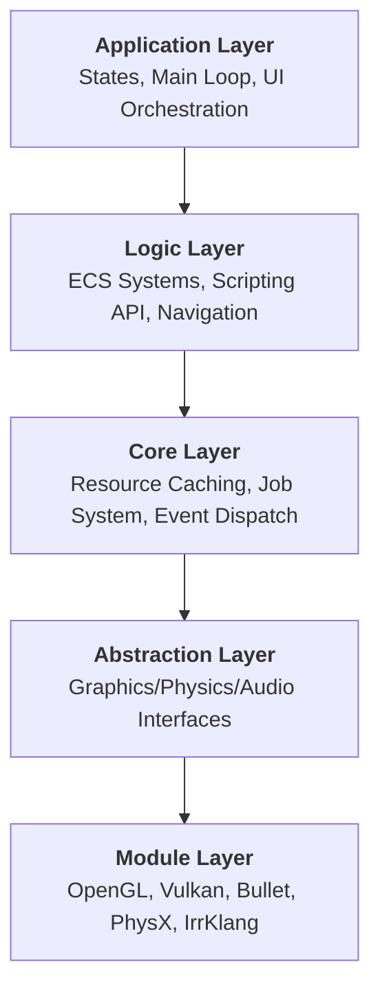

# Hybrid Modular Architecture

AXIS Engine is built on a **Modular Abstraction Layer** that decouples high-level gameplay logic from low-level hardware implementations. This "Hybrid" design allows the engine to remain backend-agnostic while maintaining maximum performance via data-oriented execution.

---

## 🏗️ 1. Design Philosophy

The engine architecture follows a **Pillar-Bridge-Provider** pattern:
1.  **Pillar (Interfaces)**: Precise C++ interfaces (e.g., `IRenderSystem`, `IPhysicsWorld`) defined in the `engine::interface` namespace. These define *what* a system must do without dictating *how*.
2.  **Bridge (Core systems)**: The ECS orchestration layer (`entt`) that moves data between systems and handles lifecycle management.
3.  **Provider (Backends)**: Concrete implementations for specific APIs (e.g., `OpenGLRenderSystem`, `BulletPhysicsWorld`). These are swappable at setup or even runtime via configuration.

---

## 📐 2. Structural Layers

The engine is organized into four hierarchical layers of abstraction:

### Abstraction Mechanics
Backends are managed via **Service Locators** and **Context Wrappers**. For instance, the `RenderSystem` does not call OpenGL commands directly; it issues commands to an `IGraphicsContext` which is fulfilled by either an OpenGL or Vulkan provider.

---

## ⚙️ 3. Execution & Memory Model
- **Data-Oriented ECS**: Components are stored in contiguous memory blocks. Systems process entities in "views", ensuring high CPU cache hit rates and SIMD-friendly loops.
- **Dual-Timestep Pipeline**: 
    - **Fixed Time (60Hz)**: Deterministic steps for Physics and core state reconciliation.
    - **Variable Time**: Frame-rate independent updates for Animation, Particles, and UI.
- **Job-Based Concurrency**: A lock-free task queue distributes work (Asset decoding, Frustum Culling, Particle updates) across all CPU cores.

---

## 3. Entity-Component-System (ECS)

ECS is the backbone of the engine, separating data from logic to maximize cache efficiency.

### Entities
Entities are lightweight `uint32_t` IDs. They contain no data. Use **[EntityBuilder](file:///l:/C++/AxisEngine/docs/scripting/scriptable_api.md#entitybuilder-reference)** for fluent creation.

### Components (Data)
Pure data structures. Examples:
- **Core**: `TransformComponent`, `InfoComponent`
- **Render**: `MeshRendererComponent`, `AxisMaterialComponent`: Defines material properties and texture maps.
- **Physics**: `RigidBodyComponent`, `CharacterControllerComponent`
- **Logic**: `ScriptComponent`, `AnimationComponent`
- **Effects**: `ParticleEmitterComponent`, `AudioSourceComponent`, `VideoPlayerComponent`

### Systems (Logic)
Systems iterate over entities with matching component "views".
- **Ordered Execution**: Physics (Fixed) → Scripts → Animation → Render (Variable) → UI.

---

## 4. Major Engine Logic

### Rendering Pipeline
- **Occlusion/Frustum Culling**: Skips rendering hidden or off-screen objects.
- **Instance Batching**: Groups identical meshes to minimize draw calls.
- **Level of Detail (LOD)**: Swaps models based on camera distance.
- **Transparency**: Dedicated back-to-front pass for semi-transparent objects.
- **Render Order**: Layered rendering for UI and overlays.

### Physics Automation
- **Fixed Timestep**: Deterministic simulation regardless of frame rate.
- **Auto-Sync**: Automatically updates `TransformComponent` from physics state.
- **Callbacks**: Translates Bullet collisions into script events (`OnCollisionEnter`).

### Asset Management
- **Asynchronous Loading**: Background loading via `JobSystem` to prevent stalls.
- **Hot Reloading**: Watches file changes (Shaders) and reloads at runtime.
- **Caching**: Deduplicates asset memory via naming registry.

---

## 5. Execution Model

The engine handles timing via a **Dual-Timestep Loop**:

1.  **Fixed Update (60Hz default)**:
    - Guaranteed intervals for stable Physics and State logic.
2.  **Variable Update (Frame Rate dependant)**:
    - Responsive Scripting, Animation, and UI updates.
3.  **Render Pass**:
    - Shadow mapping → 3D Scenegraph → Particles → UI → Overlays.

---

## 6. Memory Philosophy
- **Contiguous Layout**: Components stored in packed arrays for CPU cache efficiency.
- **Smart Ownership**: Heavy assets (Models/Textures) use `std::shared_ptr` to ensure zero-duplication.
- **Ref-Counting**: Resource lifetimes are tied to scene usage.

---

## See Also
- [Scriptable API](../scripting/scriptable_api.md)
- [Scene Format (.axs)](../guides/scene_format.md)
- [Project Structure](../guides/project_structure.md)
