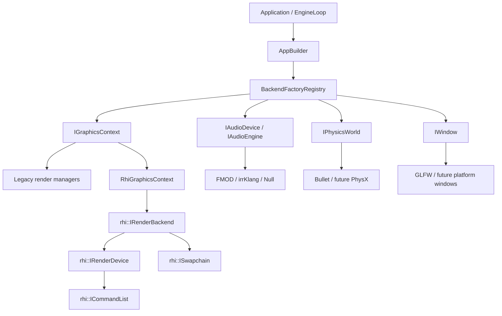
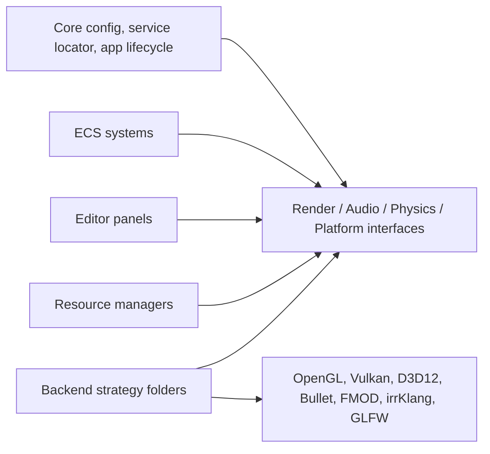

# AxisEngine Backend Abstraction Refactor

Status: implementation slice with enforced backend boundary, RHI bootstrap, audio interface expansion, physics/backend factory cleanup, and migration plan.

## Current Architecture

## Dependency Direction

Rule: upper layers depend on interfaces only. Vendor SDK headers and backend API calls are confined to backend strategy folders and checked by `tools/check_backend_boundaries.ps1`.

## Coupling Found

- `AppBuilder` directly selected concrete graphics, audio, physics, and window classes.
- Editor and diagnostics queried OpenGL/DXGI details directly for GPU name, VRAM, and texture previews.
- `SystemManager` performed raw OpenGL timer-query reads.
- Physics debug rendering knew about Bullet debug drawer setup.
- Audio exposed only `IAudioEngine`, with missing device/channel/listener/stream/event interface names.
- GLFW was visible in editor-facing ImGui initialization.
- Legacy render resources still carry `Texture::id`; this is isolated for editor preview but remains a larger renderer migration item.

## Implemented

- Added `BackendFactoryRegistry` and compile-time backend registration entry point.
- Moved runtime backend selection through registry factories.
- Added public RHI object names and kept the existing `rhi::IRenderBackend`, `IRenderDevice`, `ISwapchain`, and `ICommandList` path as the graphics backend contract.
- Registered OpenGL, Vulkan, DirectX12, Bullet, FMOD, irrKlang, Null Audio, and GLFW backends behind factories.
- Added `IGraphicsContext::TryGetVramUsage`, `GetDeviceName`, RHI backend access, and legacy-pipeline capability checks.
- Moved GPU timer queries, VRAM display, GPU device name, and texture-preview native handles behind render interfaces.
- Added `IAudioDevice`, `IAudioChannel`, `IAudioListener`, `IAudioStream`, and `IAudioEvent` interface names.
- Registered audio services as both `IAudioDevice` and `IAudioEngine`.
- Removed Bullet helper includes from ECS/physics logic and moved debug-render binding through backend registration.
- Moved GLFW ImGui implementation to the GLFW strategy folder and made the editor-facing header use an opaque native handle.
- Added backend boundary audit coverage for OpenGL, Vulkan, DirectX, GLFW, Bullet, PhysX, FMOD, and irrKlang.

## RHI Status

The RHI contract now covers device, buffers, textures/images, samplers, shader modules, descriptor sets/layouts, pipelines, command lists, swapchain, and render-pass begin data. Vulkan and DirectX12 use this contract for native backend bootstrap and swapchain clear. OpenGL remains the complete legacy renderer backend.

The full material, mesh, UI, shadow, post-process, and asset upload pipeline still uses legacy render managers. That path is explicitly separated by `IGraphicsContext::SupportsLegacyRenderPipeline()` so migration can proceed system by system.

## Physics Status

Gameplay-facing systems use physics interfaces. Bullet-specific setup is isolated to the Bullet strategy folder. The current implementation has Bullet only; PhysX can be added by registering a new `IPhysicsWorld` factory and keeping all `Px*` usage inside `Physics/PhysX`.

## Audio Status

The current FMOD, irrKlang, and Null Audio backends are behind audio interfaces. The interface names requested by the backend abstraction task now exist. Listener and event objects are still mostly device-level operations; concrete listener/event wrappers should be added when gameplay/editor code needs object ownership beyond current device methods.

## Risks

- Full render migration is the largest risk because `Texture::id`, `Shader`, `Mesh`, and draw submission are still shaped around the legacy OpenGL manager model.
- Editor ImGui rendering is currently implemented as GLFW + OpenGL backend glue. Vulkan/DX12 editor rendering needs backend-specific ImGui adapters.
- RHI backend feature parity is limited until render systems stop relying on legacy managers.
- Adding PhysX will be straightforward at the interface boundary but non-trivial for collision events, character controllers, and asset cooking.

## Migration Strategy

1. Keep OpenGL legacy rendering stable behind `SupportsLegacyRenderPipeline()`.
2. Move resource GPU ownership from `Texture::id` and similar raw fields to RHI handles.
3. Convert mesh/material upload to `rhi::IRenderDevice`.
4. Convert frame passes to `rhi::ICommandList` submission.
5. Add backend-specific ImGui renderer adapters for Vulkan and DirectX12.
6. Add PhysX by implementing `IPhysicsWorld`, `IRigidBody`, `ICollisionShape`, `ICharacterController`, `IConstraint`, and query/collision dispatch adapters.
7. Add the boundary audit script to CI so new vendor API usage cannot leak upward.

